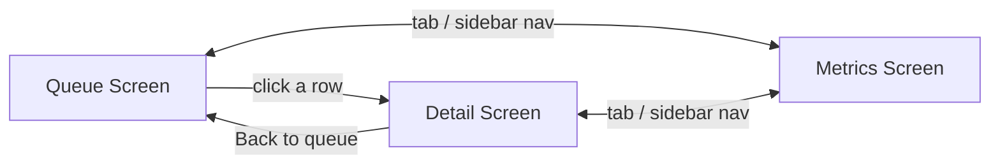

# APP_FLOW — every screen, every state, every button

Three screens total, all inside the single `app.py`. Streamlit reruns the whole script on every
interaction, so navigation and "which dispute am I looking at" are tracked explicitly in
`st.session_state` — not implicit, not assumed.

Top-level navigation between the 3 screens: `st.tabs(["Queue", "Metrics"])`, with Detail reached
only by selecting a row from Queue (not its own top-level tab) — Detail always needs a
`dispute_id` in `st.session_state`, and Queue is what sets it.

---

## Screen 1 — Dispute Queue (default / landing screen)

**Purpose:** the reviewer's starting point — every dispute, at a glance, triageable.

**Elements:**
- `st.dataframe` (or `st.data_editor` read-only) showing all 60 disputes: `id`, `reason_code`,
  `amount` (formatted ₹, not raw paise), `confidence_score`, `recommended_action`,
  `status` (Razorpay lifecycle status, not our recommendation — keep these visually distinct,
  see `UI_UX.md` §3).
- A sort control: by `confidence_score` (ascending, so the reviewer can triage the shakiest cases
  first) — Streamlit's dataframe column-header sort is enough, no custom control needed.
- A filter: by `recommended_action` (`contest` / `escalate` / `accept` / all) — a simple
  `st.selectbox` above the table.

**States:**
- Default: full table, unfiltered, sorted by confidence ascending.
- Filtered: table shows only the selected `recommended_action`.
- Row selected: sets `st.session_state["selected_dispute_id"]` and switches to the Detail screen.

**Buttons / actions:**
- Clicking a row (via `st.dataframe`'s built-in row-selection, or a "View" button per row if
  row-selection isn't available in the Streamlit version used) → sets
  `st.session_state["selected_dispute_id"]` → renders Detail screen content in place of Queue.

---

## Screen 2 — Dispute Detail

**Purpose:** the full evidence trail and decision reasoning for one dispute — this is the screen
that has to make a skeptical judge trust the system, so nothing here is summarized away.

**Elements, top to bottom:**
1. Header: dispute `id`, `reason_code`, `amount`, Razorpay `status` badge, our
   `recommended_action` badge (see `UI_UX.md` §3 for the color/label mapping).
2. **Mandate** section: spending cap, valid window, authorized merchant.
3. **Agent Action Log** section: every linked `agent_actions` row, in timestamp order — this is
   the "no click trail, but here's what we have instead" section, worth making legible, not an
   afterthought.
4. **Fulfillment** section: order status, `fulfilled_at` if present.
5. **Rule Engine Result** section: all 5 checks from `BACKEND_SCHEMA.md` §3, each shown pass/fail,
   plus the resulting `confidence_score` as a literal number (not just a color — see `UI_UX.md`).
6. **Evidence Narrative** section — only rendered if `evidence_packets` has a row for this dispute:
   the `narrative_text`, plus a visible `grounding_check_passed` badge. If no evidence packet
   exists (escalated case), this section shows a plain note explaining why, not an empty box.
7. **Raw Audit Log** — `st.expander`, collapsed by default, showing every `audit_log` row for this
   dispute as formatted JSON. This is the "would you trust it" proof — it should be one click away
   on every single dispute, not buried.

**States:**
- `recommended_action = contest`, not yet human-reviewed: narrative shown, "Approve & mark
  contested" button active.
- `recommended_action = contest`, already human-approved (`decisions.decided_by = 'human'`):
  narrative shown, button replaced with a plain "✓ Approved by reviewer" note.
- `recommended_action = escalate`: no narrative section content (just the explanatory note),
  "Approve" button not shown at all — only a "Mark as manually resolved" option, since there's
  nothing automated to approve.

**Buttons / actions:**
- **"Approve & mark contested"** — only rendered when `recommended_action = contest` and not yet
  approved. Writes `decisions.decided_by = 'human'`, appends an `audit_log` row
  (`event_type = 'human_override'` is the wrong label here — use `human_approval`), re-renders.
- **"Escalate to human"** — available on any dispute, for a reviewer who doesn't trust a
  `contest` recommendation despite the system's confidence. Writes an `audit_log` row
  (`event_type = 'human_override'`), changes displayed `recommended_action` to `escalate` for
  that record.
- **"← Back to queue"** — clears `st.session_state["selected_dispute_id"]`, returns to Screen 1.

---

## Screen 3 — Metrics

**Purpose:** the honest numbers, computed live, plus the failure-recovery story front and center
— this screen exists because the brief explicitly asks for measured precision/recall and an
honest failure account, not because a dashboard "should" have a metrics page.

**Elements:**
1. Three `st.metric` cards: **Precision**, **Recall**, **False-positive count** — each computed
   live by `src/metrics.py` against the 20 held-out records, never hardcoded (see `AI_RULES.md`
   §10 — this screen is the one place that rule matters most, since it's the one judges will
   screenshot).
2. A table of all 20 held-out records: `id`, `recommended_action`, `ground_truth_label`, whether
   they matched — so a judge can verify the top-line numbers by eye, not just trust them.
3. A short, fixed markdown block: **"What broke"** — the Phase 3 documented failure (the LLM
   hallucination the grounding check caught), written once during Phase 5, displayed here
   permanently. Not generated live — this is a written account of something that already happened.

**States:** effectively one state — this screen has no interactivity beyond what's already loaded.
Keep it that way; a metrics screen with knobs and toggles invites fiddling with the numbers until
they look better, which is exactly what `AI_RULES.md` §10 exists to prevent.

**Buttons / actions:** none. This is a read-only report.
