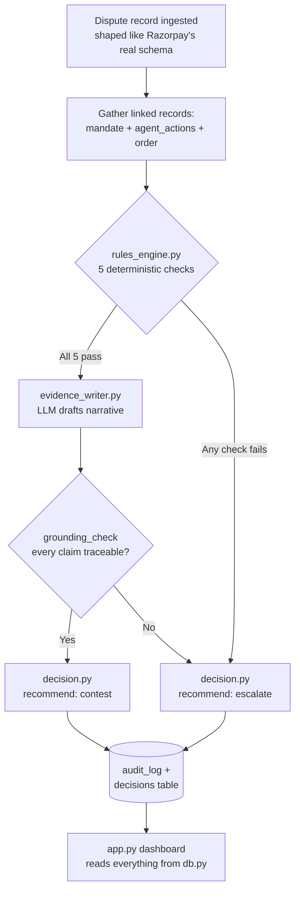

# ARCHITECTURE — folder structure, module boundaries, data flow

## 1. Guiding principles

1. **Single language, single process.** Streamlit is both the UI and the orchestration layer —
   no separate frontend, no separate API server. This removes an entire category of bugs
   (CORS, API contracts, two build tools) that cost time without improving anything judges score.
2. **The rule engine and the LLM are architecturally separated, not just conceptually.**
   `src/rules_engine.py` cannot import an LLM SDK — this is enforced by the import table in §3, and
   it's checkable by grep, not just by promise. This *is* the "AI judgment" story made structural.
3. **One direction of dependency.** `app.py` depends on `src/*`. Nothing in `src/*` ever imports
   from `app.py`. This means every piece of logic is testable without starting the dashboard.
4. **Nothing talks to SQLite except `src/db.py`.** Every other module reads/writes data through it.
   One place to change if the schema changes; no scattered raw SQL.

## 2. Folder tree

```
mandate-trail/
├── README.md
├── PRD.md
├── ARCHITECTURE.md          ← this file
├── AI_RULES.md
├── PLAN.md
├── TRD.md
├── APP_FLOW.md
├── UI_UX.md
├── BACKEND_SCHEMA.md
├── requirements.txt
├── .env.example
├── .gitignore
├── app.py                    # Streamlit entrypoint — the ONLY UI code in the repo
├── data/
│   ├── schema.sql             # CREATE TABLE statements, matches BACKEND_SCHEMA.md exactly
│   ├── seed/
│   │   └── generate_dataset.py   # builds the 60-record synthetic dataset, fixed random seed
│   └── mandate_trail.db       # generated by the seed script — gitignored, never hand-edited
├── src/
│   ├── __init__.py
│   ├── models.py               # typed dataclasses: Mandate, AgentAction, Order, Dispute, etc.
│   ├── db.py                   # all SQLite reads/writes go through here, nowhere else
│   ├── rules_engine.py         # deterministic checks + confidence score. NO LLM. NO network calls.
│   ├── evidence_writer.py      # LLM narrative generation + the grounding check
│   ├── decision.py             # orchestrates rules_engine + evidence_writer into a final decision
│   └── metrics.py              # precision/recall/false-positive cost — the ONLY module allowed
│                                # to read disputes.ground_truth_label
└── tests/
    ├── test_rules_engine.py
    ├── test_evidence_writer.py
    └── test_metrics.py
```

## 3. Module boundaries — allowed imports, forbidden imports

| Module | May import | Must never import |
|---|---|---|
| `src/rules_engine.py` | `src/models.py`, Python stdlib only | Any LLM SDK, `requests` or any network library, `src/evidence_writer.py` |
| `src/evidence_writer.py` | `src/models.py`, the LLM SDK (`google-generativeai`, or `openai` when pointed at Groq) | `src/db.py` directly — it returns data to `decision.py`, it doesn't write to the DB itself |
| `src/decision.py` | `src/rules_engine.py`, `src/evidence_writer.py`, `src/db.py` | — this is the one module allowed to see both sides; that's its whole job |
| `src/db.py` | `sqlite3` (stdlib), `src/models.py` | Any LLM SDK |
| `src/metrics.py` | `src/db.py` | `src/rules_engine.py`, `src/evidence_writer.py` — it must only read *already-recorded* decisions, never re-derive them |
| `app.py` | everything under `src/`, `streamlit` | Direct `sqlite3` calls — must go through `src/db.py` |
| `data/seed/generate_dataset.py` | `src/models.py`, `src/db.py`, stdlib `random` (seeded) | Any LLM SDK — the dataset must be deterministic, never LLM-generated |

If a change requires breaking one of these, that's a signal to stop and reconsider the design, not
to quietly add the import.

## 4. Data flow



## 5. Where does new code go? (decision table)

| You want to... | Goes in... |
|---|---|
| Add or change a rule check | `src/rules_engine.py` + its test in `tests/test_rules_engine.py` |
| Add a new synthetic dispute archetype | `data/seed/generate_dataset.py` — and add a row to `BACKEND_SCHEMA.md` §5's table in the same change |
| Change the LLM prompt or provider | `src/evidence_writer.py` only |
| Add or change a screen, button, or table column *in the UI* | `app.py` only |
| Add or change an actual database column | `data/schema.sql` AND `BACKEND_SCHEMA.md` §1 in the same change — never one without the other |
| Change how confidence is scored or weighted | `src/rules_engine.py`, and update `BACKEND_SCHEMA.md` §3 to match |

## 6. Naming conventions

- IDs: `snake_case_prefix_0001` (e.g. `mandate_0001`, `disp_0001`, `action_0001`) — zero-padded to
  4 digits, matching the scale of the dataset.
- Timestamps: unix integers everywhere internally (matches Razorpay's real convention), formatted
  to human-readable only at display time in `app.py`.
- Money: always stored as integer paise, never float rupees — matches Razorpay's real convention
  and avoids floating-point rounding bugs in a project about money.

## 7. Git conventions (solo build)

- Commit after each `PLAN.md` phase's exit criteria are met, not mid-phase.
- Commit message format: `Phase N: <what was done>` — e.g. `Phase 2: rule engine + unit tests`.
- `.env` must never appear in `git status` as staged. Check before every commit.
